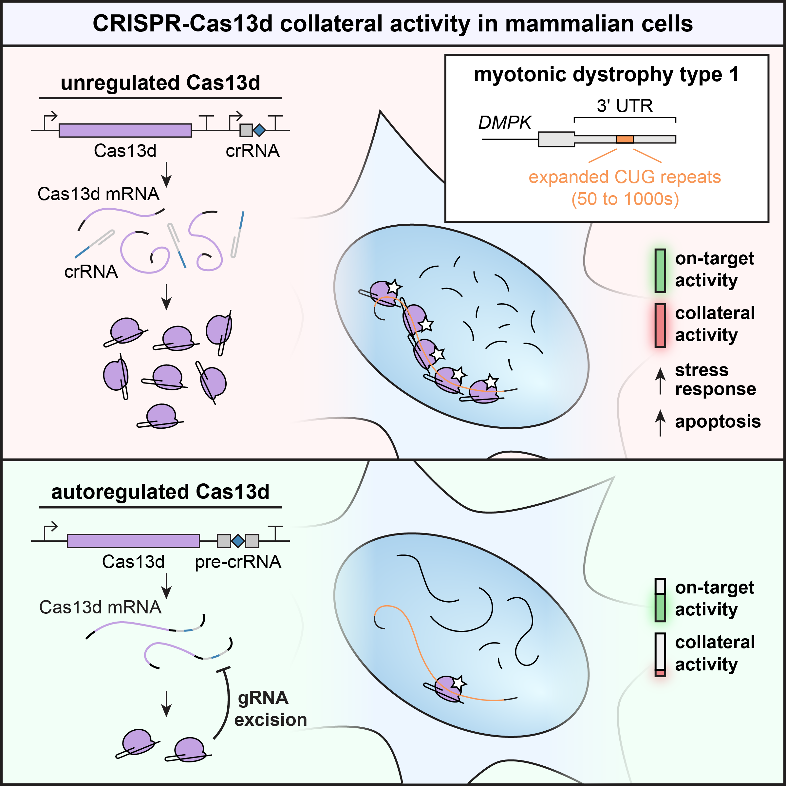

# Negative autoregulation mitigates collateral RNase activity of repeat-targeting CRISPR-Cas13d in mammalian cells

CRISPR-Cas13d is an programmable RNA-guided RNA endonuclease and a promising candidate for knockdown of RNA in mammalian cells in the lab and the clinic. However, binding of Cas13d to the target RNA unleashes non-specific cleavage of bystander RNAs, or collateral activity, which may confound RNA targeting experiments and raises concerns for Cas13d therapies. Although well appreciated in biochemical and bacterial contexts, the extent of collateral activity in mammalian cells remains disputed.

In this work, we investigated Cas13d collateral activity in the context of an RNA-targeting therapy for DM1, a disease caused by a transcribed long CTG repeat expansion. We found stark evidence of collateral activity when targeting expanded repeats and overexpressed transgenes, and we showed that collateral activity is cytotoxic even when targeting moderately-to-highly expressed endogenous genes. We introduced GENO, a negative autoregulation strategy that selectively minimizes the effects of Cas13d collateral activity when targeting repeat expansions. Our results demonstrate that thorough screening of collateral activity is necessary when applying Cas13d in mammalian cells.

## Description

## Navigation